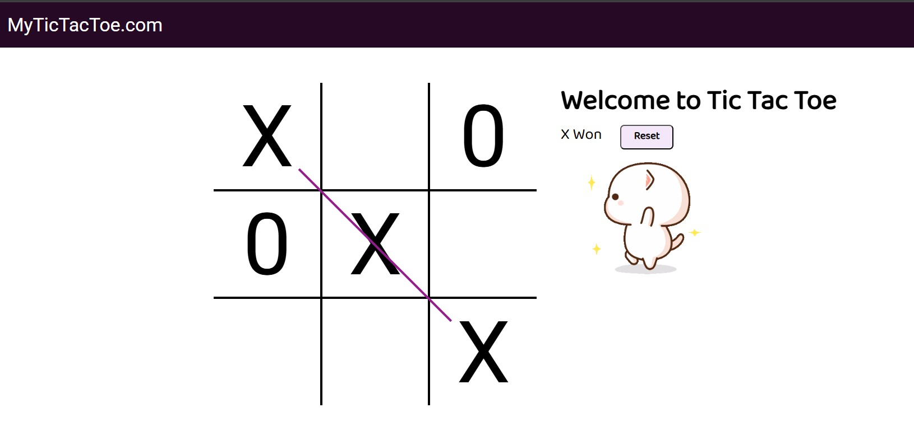

# Tic Tac Toe Game

A simple, interactive Tic Tac Toe game built using **HTML, CSS, and JavaScript**. The game supports two players (X and O), detects winning combinations, draws a winning line, and plays sound effects for moves and game over.



---

## Features

* Two-player mode (X vs O)
* Automatic win detection
* Visual winning line animation
* Sound effects for turns and game over
* Reset button to restart the game
* Clean and simple UI

---

## Project Structure

```
TIC TAC TOE/
│
├── index.html     # Main HTML file
├── style.css      # Styling for the game
├── script.js      # Game logic
├── music.mp3      # Background music
├── ting.mp3       # Turn sound
├── gameover.mp3   # Game over sound
├── excited.gif    # Winning animation
└── readme.md      # Project documentation
```

---

## How to Clone the Repository

1. Open your terminal or command prompt.
2. Run the following command:

```bash
git clone <your-repository-url>
```

Example:

```bash
git clone https://github.com/your-username/tic-tac-toe.git
```

3. Move into the project folder:

```bash
cd tic-tac-toe
```

---

## How to Play the Game

### Method 1: Open Directly in Browser

1. Locate the project folder.
2. Double-click on `index.html`.
3. The game will open in your default web browser.

### Method 2: Using VS Code Live Server (Recommended)

1. Open the project in VS Code.
2. Install the **Live Server** extension if not already installed.
3. Right-click on `index.html` and select **Open with Live Server**.
4. The game will open in your browser at `http://127.0.0.1:5500/` or similar.

---

## Game Rules

* Player X always starts first.
* Players take turns clicking empty boxes.
* First player to align three symbols in a row, column, or diagonal wins.
* When a player wins, a line is drawn through the winning combination and a message is shown.
* Click the **Reset** button to start a new game.

---

## Technologies Used

* HTML5
* CSS3
* JavaScript (Vanilla JS)

---

## Future Improvements

* Add single-player mode with AI
* Add score tracking
* Improve animations and themes
* Mobile responsiveness enhancements

---

## Contributer

The is contributed by **Anirudha Kumar Sahu**

---

Enjoy playing Tic Tac Toe!
